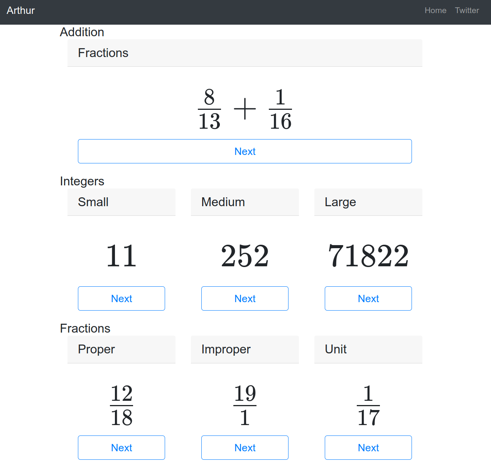

# arthur

This package is intended to provide some tools to aide
in working with mathematics content.

## Examples

### HTTP Server

Sample server that demonstrates some of arthur's usages.

```
cd examples/server
go run .
```



```
curl localhost:8080/api/v1/fraction
\frac{2}{12}
```
